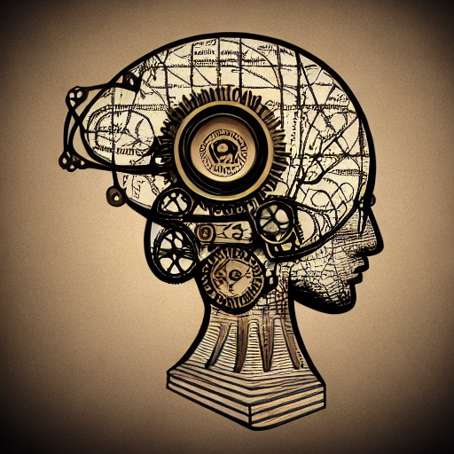
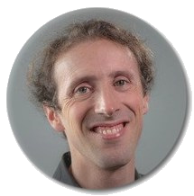
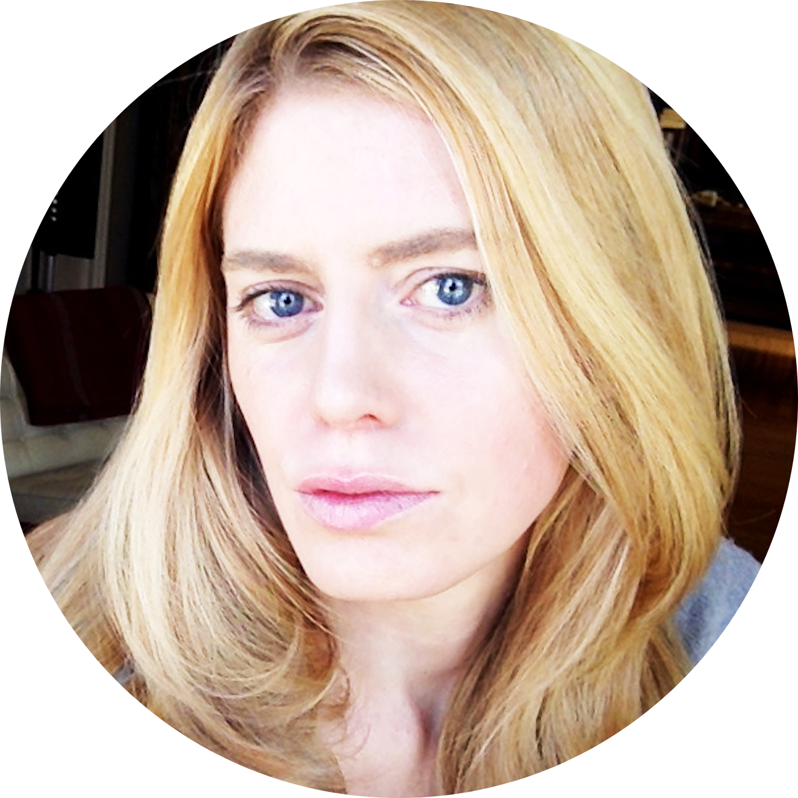
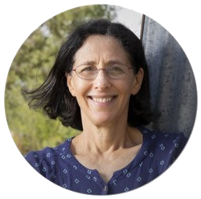
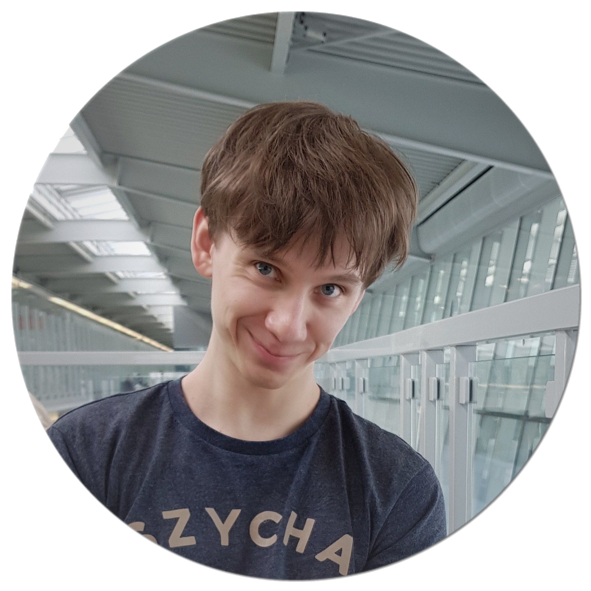
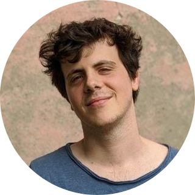

# Rethinking Computational Approaches to the Mind
### Fundamental Challenges and Future Perspectives
###  21st OCTOBER 2022
------------------------------------------------------------------------------------------------------------------------------------------------------
#### ****REGISTER HERE !!****
{: style="text-align: center;"}
{: .center-image}

[Speakers](#speakers) - [Schedule](#schedule) - [Abstracts](#abstracts) - [Organizers](#organizers)
{: style="text-align: center;"}
This one-day **online** event will bring together researchers with expertise in various areas such as complexity science, machine learning & artificial intelligence, information theory & data science, as well as computational/theoretical neuroscience & philosophy to explore different computational approaches in the study of the "mind" (in brains and/or machines): 

1. What are those approaches essentially about? 
2. What are major benefits & caveats? 
3. Do different approaches speak to, complement, or contradict each other? 
4. What are the current challenges in computational approaches to understand the mind, and what could bring progress?

The event is organized within the "Sensation and Perception to Awareness: Leverhulme Doctoral Scholarship Programme" at the Univeristy of Sussex (find more info [here](#organizers)), and will comprise a set of talks followed by a panel discussion (see [schedule](#schedule)).
## Speakers

### Joseph Lizier

[Personal Website](https://lizier.me/joseph/) - [Twitter](https://twitter.com/jlizier) - [Google Scholar](https://scholar.google.com/citations?user=QJwapBoAAAAJ&hl=en) - [GitHub](https://github.com/jlizier)
{: style="text-align: center;"}

Bio

 
Associate Professor Joseph Lizier (PhD, 2010) is a member of the School of Computer Science in the Faculty of Engineering at The University of Sydney (since 2015). His research studies the dynamics of information processing in biological and bio-inspired complex systems and networks, focussing both on fundamental theoretical advances as well as applications to neural systems and collective animal behaviour. He is a lead developer of the JIDT and IDTxl toolboxes for using information theory to characterise dynamics of information flows and effective structure of complex systems time-series. A/Prof. Lizier teaches into the University's Master of Complex Systems degree, and is a deputy director of the Centre for Complex Systems. He is a member of the editorial boards of Entropy, Complexity, Theory in Bioscience, Complex Systems, and Frontiers in Robotics and AI. He has held postdoctoral positions at CSIRO and Max Planck Institute Leipzig, and worked in the telecommunications industry for 10 years, including at Seeker Wireless and Telstra Research Laboratories.

---------------------------------------------------------------------------------------------------------------------------------------------------------
### Romaine Brette

[Personal Website](http://romainbrette.fr/) - [Twitter](https://twitter.com/RomainBrette) - [Google Scholar](https://scholar.google.com/citations?hl=en&user=lEHiPU4AAAAJ) - [GitHub](https://github.com/romainbrette)
{: style="text-align: center;"}

Bio

 
Romain Brette is a theoretical neuroscientist in Paris who has worked in cellular biophysics and systems neuroscience, specifically on modelling auditory perception. This work has led him to reflect on the foundational concepts of neural modeling and computational neuroscience, such as neural codes, computation and information.

---------------------------------------------------------------------------------------------------------------------------------------------------------
### Gael Varoquax

[Personal Website](https://gael-varoquaux.info/) - [Twitter](https://twitter.com/gaelvaroquaux) - [Google Scholar](https://scholar.google.com/citations?user=OGGu384AAAAJ&hl=en) - [GitHub](https://github.com/GaelVaroquaux)
{: style="text-align: center;"}

Bio

 
Gael Varoquax is the Research Director of soda at Inria (National Institute for Research in Digital Science and Technology, in Paris). He's also the director of the [scikit-learn operations at Inria foundation](https://scikit-learn.fondation-inria.fr/home/). His research focuses on the use of machine learning in the public/mental health sector, and its potential in understanding cognition and brain activity.

---------------------------------------------------------------------------------------------------------------------------------------------------------
### Konrad Kording

[Personal Website](http://koerding.com/) - [Twitter](https://twitter.com/KordingLab?ref_src=twsrc%5Egoogle%7Ctwcamp%5Eserp%7Ctwgr%5Eauthor) - [Google Scholar](https://scholar.google.com/citations?user=MiFqJGcAAAAJ&hl=en) - [GitHub](https://github.com/KordingLab)
{: style="text-align: center;"}

Bio

 
Dr. Kording (He/Him) is trying to understand how the world and in particular the brain works using data. Early research in the lab focused on computational neuroscience and in particular movement. But as the approaches matured, the focus has more been on discovering ways in which new data sources as well as emerging data analysis can enable awesome possibilities. The current focus is on Causality in Data science applications - how do we know how things work if we can not randomize? But we are also very much excited about understanding how the brain does credit assignment. Our style of working is transdisciplinary, we collaborate on virtually every project

---------------------------------------------------------------------------------------------------------------------------------------------------------
### Jessica Flack

[Personal Website](https://c4.santafe.edu/people/c4Jessica/) - [Twitter](https://twitter.com/c4computation?lang=en) 
{: style="text-align: center;"}

Bio

 
Prof. Flack is a professor at Sante Fe Institute, New Mexico, where she runs Collective Computation Group. Her research focuses on evolutionary theory, cognitive neuroscience and behavior, statistical mechanics, information theory, dynamical systems and theoretical computer science to study the roles of information processing and collective computation in the emergence of robust structure and function in adaptive systems.

---------------------------------------------------------------------------------------------------------------------------------------------------------
### Melanie Mitchell

[Personal Website](https://melaniemitchell.me/) - [Twitter](https://twitter.com/MelMitchell1) - [Google Scholar](https://scholar.google.com/citations?user=4xK5uaQAAAAJ&hl=en)
{: style="text-align: center;"}

Bio

 
bio

    
## Schedule

| TIME (GMT +1 - London) | Speaker          | Talk Title |
|:-----------------------:|:----------------:|:----------:|
|       2:30-3:00pm       | Joseph Lizier    | ["Enabling tools to model information processing in complex systems"](#speaker-jospeh-lizier)|
|       3:00-3:30pm       | Romaine Brette   | ["Computation in the brain"](#speaker-romain-brette)|
|       3:30-4:00pm       | Gael Varoquax    | [TBA](#speaker-gael-varoquaux)        |
|       4:00-4:30pm       | BREAK            |            |
|       4:30-5:00pm       | Konrad Kording   | ["Causality in the Brain"](#speaker-konrad-kording)|
|       5:00:5:30pm       | Jessica Flack    | [TBA](#speaker-jessica-flack)        |
|       5:30-5:45pm       | Melanie Mitchell | ["Why AI is Harder Than We Think"](#speaker-melanie-mitchell)|
|       5:45-6:45pm       | PANEL DISCUSSION |            |
{: .tablelines}

## Abstracts

#### **Speaker:** Joseph Lizier

**Talk title:** "Enabling tools to model information processing in complex systems"

**Time:** 2:30pm GMT +1

<strong>Abstract:</strong> The space-time dynamics of interactions in complex systems are often described using terminology of information processing, or distributed computation, in particular with reference to information being stored, transferred and modified in these systems. In this talk, I will introduce an information-theoretic framework -- information dynamics -- that we use to model each of these operations on information within a complex system, and their dynamics in space and time. Not only does this framework quantitatively align with natural qualitative descriptions of information processing in neural and other systems, it provides multiple complementary perspectives on how, where and why a system is exhibiting complexity. Specifically, I will describe tools we have produced to enable quantitative analysis of such information processing, including both theoretical advances (such as how to measure information flows between spike trains) and software toolkits (including JIDT and IDTxl). I will focus specifically on the interaction between theory, enabling tools and applications, and how we have addressed methodological challenges at their intersection.

#### **Speaker:** Romain Brette

**Talk title:** "Computation in the brain"

**Time:** 3:00pm GMT +1

<strong>Abstract:</strong>  It is often taken for granted that brains compute over neural representations. Traditionally, this means that properties of neural activity play the role of variables in correspondence with properties of things in the world, while brain processes play the role of algorithms that manipulate those variables. This claim is based on implicit assumptions, which require closer examination. The first one is that all behavior is computational. To the extent that “computational” is meaningful, this is false. The second one is neural reductionism: the idea that alleged psychological units (such as the percept of a face) must correspond to neurophysiological units (activity of specific neurons or groups of neurons), rather than to a mode of activity of the brain. The third one is that neural representations correspond to neurophysiological states, which can then be governed by computational processes. But neural representations are not brain states: they are experimental measurements of firing rates over an extended period after a presented stimulus; that is, they are already properties of brain processes. This confusion undermines the coherence of neurocomputationalism.

#### **Speaker:** Gael Varoquax 

**Talk title: TBA** 

**Time:** 3:30pm GMT +1

<strong>Abstract: TBA</strong>

#### **Speaker:** Konrad Kording 

**Talk title:** "Causality in the brain"

**Time:** 4:30pm GMT +1

<strong>Abstract:</strong> Konrad Kording will introduce the conceptual role that causation plays in most neuroscientists ways of thinking about the brain – both in the context of medical applications and in the context of basic research. He will contrast this conceptual role with the limitations of scientists to experimentally get at causality. Perturbation, the one methods that does allow reliably establishing causality does not scale to high dimensions. This makes understanding a complex system with many interacting parts highly problematic. He will end with an overview of coming approaches, in particular connectomics, that may change the current status quo in neural causality research.

#### **Speaker:** Jessica Flack

**Talk title: TBA** 

**Time:** 5:00pm GMT +1

<strong>Abstract: TBA</strong> 

#### **Speaker:** Melanie Mitchell

**Talk title:** "Why AI is Harder Than We Think"

**Time:** 5:30pm GMT +1

<strong>Abstract:</strong> Since its beginning in the 1950s, the field of artificial intelligence has cycled several times between periods of optimistic predictions and massive investment (“AI Spring”) and periods of disappointment, loss of confidence, and reduced funding (“AI Winter”). Even with today’s seemingly fast pace of AI breakthroughs, the development of long-promised technologies such as self-driving cars, housekeeping robots, and conversational companions has turned out to be much harder than many people expected.
One reason for these repeating cycles is our limited understanding of the nature and complexity of intelligence itself.  In this talk I will discuss some fallacies in common assumptions made by AI researchers, which can lead to overconfident predictions about the field. I will also speculate on what kinds of new ideas and new science will be needed for the grand challenge of making AI systems more robust, general, and adaptable—in short, more intelligent.

## Organizers
{: .logo} 
The symposium is organized within the ['Sensation and Perception to Awareness: Leverhulme Doctoral Scholarship Programme'](https://www.sussex.ac.uk/sensation/) directed by Jamie Ward and Anil Seth at the University of Sussex. It brings together researchers from across neuroscience, philosophy, psychology, robotics, and the arts, with the aim of advancing our understanding of interactions between sensation, perception, and awareness in humans, animals, and machines. As part of the programme, doctoral researchers are encouraged to be involved in seminar and conference organisation. For this symposium, the organizers are:
### Tomasz Korbak
In his doctoral project, Tomek is working on deep reinforcement learning and generative models with Chris Buckley and Anil Seth. He focuses on probabilistic approaches to control, such as active inference and control-as-inference, and controllable generative modelling.

[Personal Website](https://tomekkorbak.com/) - [Twitter](http://twitter.com/tomekkorbak) - [Google Scholar](http://scholar.google.com/citations?user=YQ5rrk4AAAAJ) - [Github](http://github.com/tomekkorbak) - [Linkedin](http://linkedin.com/in/tomaszkorbak)
---------------------------------------------------------------------------------------------------------------------------------------------------------

### Federico Micheli (He/Him)

Federico is a PhD student at the University of Sussex, working under the superivsion of Dr Peter Lush, Prof. Warrick Roseboom and Prof. Anil Seth. His interests span all over consciousness science. In his project, he's working on the cognitive penetrability of perception thesis, using insights from experimental hypnosis research to answer outstanding questions on the origin and nature of perceptual illusions. 

[Twitter](http://twitter.com/miguelo93)
---------------------------------------------------------------------------------------------------------------------------------------------------------

### Nadine Spychala (She/Her)

Nadine is a doctoral researcher in computational neuroscience and complex systems where she validates information-theoretic measures of complexity and emergence in both simulated and empirical data. Her work can be described as a solid mixture of mathematics, machine learning, neuroscience, as well as philosophy. She cares about open & reproducible research (and, in this context, good research software) that is aligned with ethical research culture & incentives.

[Personal Website](https://nadinespy.github.io/) - [Twitter](https://twitter.com/NadineSpychala) - [Google Scholar](https://scholar.google.com/citations?user=azGyyRUAAAAJ&hl=de&oi=ao) - [GitHub](https://github.com/nadinespy) - [LinkedIn](https://www.linkedin.com/in/nadine-spychala-9a952714b/)  
