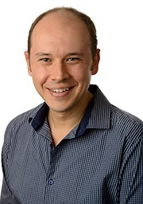
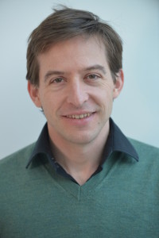
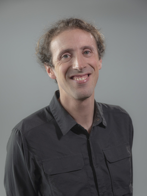

# Rethinking computational approaches to the brain
### Fundamental challenges and future perspectives 
------------------------------------------------------------------------------------------------------------------------------------------------------
#### 21st OCTOBER 2022 - Register Here !!

This online event will bring together researchers with expertise in various areas such as complexity science, machine learning, as well as theoretical neuroscience & philosophy to explore different computational approaches in the study of brain functioning : 

1. What are those approaches essentially about? 
2. What are major benefits & caveats? 
3. Do different approaches speak to, complement, or contradict each other? 
4. What would bring research in the computational sciences forward?
5. What can bring progress into computational approaches to understand the brain?

## Speakers

### Joseph Lizier
Prof. Joseph Lizier is an Associate Professor in Complex Systems at the Univeristy of Sidney, Australia, in the Complex Systems Research Group and Centre for Complex Systems. His research focuses on information processing in biological and bio-inspired complex networks, including in the computational neuroscience domain.

[Personal website](https://lizier.me/joseph/) - [twitter](https://twitter.com/jlizier) - [Google Scholar](https://scholar.google.com/citations?user=QJwapBoAAAAJ&hl=en)
    
### Romaine Brette

Romain Brette is the Director in computational and theoretical neuroscience in the Institute de la vision, in Paris, where He leads the Computational neuroscience of sensory systems group. His main interests are neural modeling of perception, spike initiation, as well as epstemology of theoretical and computational neuroscience.

[Personal website](http://romainbrette.fr/) - [twitter](https://twitter.com/RomainBrette) - [Google Scholar](https://scholar.google.com/citations?hl=en&user=lEHiPU4AAAAJ)
    
### Gael Varoquax

Gael Varoquax is the Research Director of soda at Inria (National Institute for Research in Digital Science and Technology, in Paris). He's also the director of the [scikit-learn operations at Inria foundation](https://scikit-learn.fondation-inria.fr/home/). His research focuses on the use of machine learning in the public/mental health sector, and its potential in understanding cognition and brain activity.

[Personal website](https://gael-varoquaux.info/) - [twitter](https://twitter.com/gaelvaroquaux) - [Google Scholar](https://scholar.google.com/citations?user=OGGu384AAAAJ&hl=en)
    
### Konrad Kording
Dr. Kording is a Penn Integrates Knowledge professor at University of Pennsylvania. Early research in the lab focused on computational neuroscience and in particular movement. The current focus is on Causality in Data science applications. Dr. Kording he's also interested in the question of how the brain solves the credit assignment problem and similarly how we should assign credit in the real world (through causality). 

[Personal website](http://koerding.com/) - [twitter](https://twitter.com/gaelvaroquaux) - [Google Scholar](https://scholar.google.com/citations?user=MiFqJGcAAAAJ&hl=en)

### Jessica Flack

Prof. Flack is a professor at Sante Fe Institute, New Mexico, where she runs Collective Computation Group. Her research focuses on evolutionary theory, cognitive neuroscience and behavior, statistical mechanics, information theory, dynamical systems and theoretical computer science to study the roles of information processing and collective computation in the emergence of robust structure and function in adaptive systems.

[Personal website](https://c4.santafe.edu/) - [twitter](https://twitter.com/c4computation?lang=en) 

### Melanie Mitchell

Melanie Mitchell is the Davis Professor at the Santa Fe Institute. Her current research focuses on conceptual abstraction, analogy-making, and visual recognition in artificial intelligence systems. 

[Personal website](https://melaniemitchell.me/) - [twitter](https://twitter.com/MelMitchell1) - [Google Scholar]([https://scholar.google.com/citations?user=MiFqJGcAAAAJ&hl=en](https://scholar.google.com/citations?user=4xK5uaQAAAAJ&hl=en))
