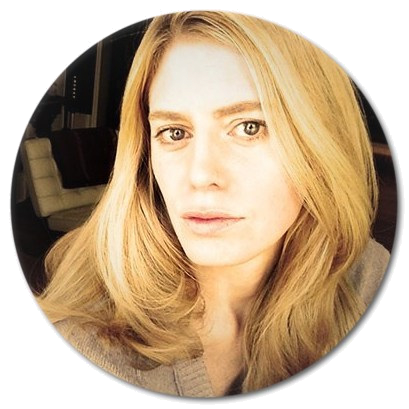

# Rethinking Computational Approaches to the Brain
### Fundamental challenges and future perspectives - 21st OCTOBER 2022
------------------------------------------------------------------------------------------------------------------------------------------------------
#### 21st OCTOBER 2022 - Register Here !!
{: .center-image}

[Speakers](#speakers) - [Schedule](#schedule) - [Organizers](#organizers)
{: style="text-align: center;"}
This **online** event will bring together researchers with expertise in various areas such as complexity science, machine learning, as well as theoretical neuroscience & philosophy to explore different computational approaches in the study of brain functioning : 

1. What are those approaches essentially about? 
2. What are major benefits & caveats? 
3. Do different approaches speak to, complement, or contradict each other? 
4. What would bring research in the computational sciences forward?
5. What can bring progress into computational approaches to understand the brain?

The event is organized within the "Sensation and Perception to Awareness: Leverhulme Doctoral Scholarship Programme" at the Univeristy of Sussex. You can find more info [here](#organizers)
## Speakers

### Joseph Lizier

**Talk title:** "Enabling tools to model information processing in complex systems"

<strong>Abstract:</strong> The space-time dynamics of interactions in complex systems are often described using terminology of information processing, or distributed computation, in particular with reference to information being stored, transferred and modified in these systems. In this talk, I will introduce an information-theoretic framework – information dynamics – that we use to model each of these operations on information within a complex system, and their dynamics in space and time. Not only does this framework quantitatively align with natural qualitative descriptions of information processing in neural and other systems, it provides multiple complementary perspectives on how, where and why a system is exhibiting complexity. Specifically, I will describe tools we have produced to enable quantitative analysis of such information processing, including both theoretical advances (such as how to measure information flows between spike trains) and software toolkits (including JIDT and IDTxl). I will focus specifically on the interaction between theory, enabling tools and applications, and how we have addressed methodological challenges at their intersection.

**Bio:** Associate Professor Joseph Lizier is a member of the Centre for Complex Systems and School of Computer Science at the Faculty of Engineering at The University of Sydney. His research focuses on studying the dynamics of information processing in biological and bio-inspired complex systems and networks, using tools from information theory to reveal when and where in a complex system information is being stored, transferred and modified. A/Prof. Lizier's research has produced fundamental theoretical insights into the nature of information processing, whilst simultaneously being successfully applied to a number of domains including computational neuroscience, where it has revealed directed information structure in the brain from neural recordings. A/Prof. Lizier is a developer of the JIDT toolbox for measuring the dynamics of complex systems using information theory, and the related IDTxl toolbox for inferring effective network structure in neural data. He teaches into the University's Master of Complex Systems degree, is a Deputy Director of the Centre for Complex Systems, and a member of various editorial boards including Entropy, Complexity and Frontiers in Robotics and AI. Before joining The University of Sydney in 2015, A/Prof. Lizier held postdoctoral positions at CSIRO ICT Centre and Max Planck Institute for Mathematics in the Sciences Leipzig, worked in the telecommunications industry for 10 years including at Seeker Wireless and Telstra Research Laboratories, and obtained a PhD in Computer Science from The University of Sydney in 2010.

[Personal website](https://lizier.me/joseph/) - [twitter](https://twitter.com/jlizier) - [Google Scholar](https://scholar.google.com/citations?user=QJwapBoAAAAJ&hl=en)
   

### Romaine Brette

**Talk title:** "Computation in the brain"

<strong>Abstract:</strong>  It is often taken for granted that brains compute over neural representations. Traditionally, this means that properties of neural activity play the role of variables in correspondence with properties of things in the world, while brain processes play the role of algorithms that manipulate those variables. This claim is based on implicit assumptions, which require closer examination. The first one is that all behavior is computational. To the extent that “computational” is meaningful, this is false. The second one is neural reductionism: the idea that alleged psychological units (such as the percept of a face) must correspond to neurophysiological units (activity of specific neurons or groups of neurons), rather than to a mode of activity of the brain. The third one is that neural representations correspond to neurophysiological states, which can then be governed by computational processes. But neural representations are not brain states: they are experimental measurements of firing rates over an extended period after a presented stimulus; that is, they are already properties of brain processes. This confusion undermines the coherence of neurocomputationalism.

**Bio:** Romain Brette is a theoretical neuroscientist in Paris who has worked in cellular biophysics and systems neuroscience, specifically on modelling auditory perception. This work has led him to reflect on the foundational concepts of neural modeling and computational neuroscience, such as neural codes, computation and information.

[Personal website](http://romainbrette.fr/) - [twitter](https://twitter.com/RomainBrette) - [Google Scholar](https://scholar.google.com/citations?hl=en&user=lEHiPU4AAAAJ)
   
### Gael Varoquax

Gael Varoquax is the Research Director of soda at Inria (National Institute for Research in Digital Science and Technology, in Paris). He's also the director of the [scikit-learn operations at Inria foundation](https://scikit-learn.fondation-inria.fr/home/). His research focuses on the use of machine learning in the public/mental health sector, and its potential in understanding cognition and brain activity.

[Personal website](https://gael-varoquaux.info/) - [twitter](https://twitter.com/gaelvaroquaux) - [Google Scholar](https://scholar.google.com/citations?user=OGGu384AAAAJ&hl=en)
   
### Konrad Kording
Dr. Kording is a Penn Integrates Knowledge professor at University of Pennsylvania. Early research in the lab focused on computational neuroscience and in particular movement. The current focus is on Causality in Data science applications. Dr. Kording he's also interested in the question of how the brain solves the credit assignment problem and similarly how we should assign credit in the real world (through causality). 

[Personal website](http://koerding.com/) - [twitter](https://twitter.com/gaelvaroquaux) - [Google Scholar](https://scholar.google.com/citations?user=MiFqJGcAAAAJ&hl=en)
   
### Jessica Flack

Prof. Flack is a professor at Sante Fe Institute, New Mexico, where she runs Collective Computation Group. Her research focuses on evolutionary theory, cognitive neuroscience and behavior, statistical mechanics, information theory, dynamical systems and theoretical computer science to study the roles of information processing and collective computation in the emergence of robust structure and function in adaptive systems.

[Personal website](https://c4.santafe.edu/) - [twitter](https://twitter.com/c4computation?lang=en) 
   
### Melanie Mitchell

**Talk title:** "Why AI is Harder Than We Think"

<strong>Abstract:</strong> Since its beginning in the 1950s, the field of artificial intelligence has cycled several times between periods of optimistic predictions and massive investment (“AI Spring”) and periods of disappointment, loss of confidence, and reduced funding (“AI Winter”). Even with today’s seemingly fast pace of AI breakthroughs, the development of long-promised technologies such as self-driving cars, housekeeping robots, and conversational companions has turned out to be much harder than many people expected.
One reason for these repeating cycles is our limited understanding of the nature and complexity of intelligence itself.  In this talk I will discuss some fallacies in common assumptions made by AI researchers, which can lead to overconfident predictions about the field. I will also speculate on what kinds of new ideas and new science will be needed for the grand challenge of making AI systems more robust, general, and adaptable—in short, more intelligent.

**Bio:** 

[Personal website](https://melaniemitchell.me/) - [twitter](https://twitter.com/MelMitchell1) - [Google Scholar]([https://scholar.google.com/citations?user=MiFqJGcAAAAJ&hl=en](https://scholar.google.com/citations?user=4xK5uaQAAAAJ&hl=en))
    
## Schedule

| TIME (GMT +01 - London) | Speaker          | Talk Title |
|:-----------------------:|:----------------:|:----------:|
|       2:30-3:00pm       | Joseph Lizier    | "Enabling tools to model information processing in complex systems"|
|       3:00-3:30pm       | Romaine Brette   | "Computation in the brain"|
|       3:30-4:00pm       | Gael Varoquax    | TBA        |
|       4:00-4:30pm       | BREAK            |            |
|       4:30-5:00pm       | Konrad Kording   | TBA        |
|       5:00:5:30pm       | Jessica Flack    | TBA        |
|       5:30-5:45pm       | Melanie Mitchell | "Why AI is Harder Than We Think"|
|       5:45-6:45pm       | PANEL DISCUSSION |            |
{: .tablelines}

## Organizers
{: .logo} 
The symposium is organized within the ['Sensation and Perception to Awareness: Leverhulme Doctoral Scholarship Programme'](https://www.sussex.ac.uk/sensation/) at the University of Sussex. As part of the programme, students are encouraged to lead research activities including seminar and conference organisation, backed by robust dedicated administrative support and funding. For this symposium the organizers are :
### Tomasz Korbak
I’m a PhD student at the Department of Informatics, University of Sussex working on deep reinforcement learning and generative models with Chris Buckley and Anil Seth. I’m focusing on probabilistic approaches to control, such as active inference and control-as-inference, and controllable generative modelling.
### Federico Micheli
asdasd
### Nadine Spychala
Nadine is German

